# Lung Cancer Risk Analysis and Prediction

## Overview

This repository presents an exploratory data analysis (EDA) and a supervised machine learning study on a survey-based lung cancer dataset. The objective is twofold: (i) to characterize the statistical associations between self-reported symptoms, behavioral factors, and lung cancer diagnosis, and (ii) to train a classification model capable of predicting lung cancer status from these features. The dataset used is the [Lung Cancer dataset](https://www.kaggle.com/datasets/mysarahmadbhat/lung-cancer) published on Kaggle.

## Dataset Description

The dataset consists of **309 survey responses** across **16 attributes**, comprising one target variable (`LUNG_CANCER`) and 15 predictor variables. All behavioral and symptomatic variables are binary-encoded (1 = No / Absent, 2 = Yes / Present), with the exception of `GENDER` (M/F, categorical) and `AGE` (numeric).

| Category | Variables |
|---|---|
| Demographic | `GENDER`, `AGE` |
| Behavioral | `SMOKING`, `ALCOHOL CONSUMING`, `PEER_PRESSURE` |
| Psychological | `ANXIETY` |
| Physical / Clinical Symptoms | `YELLOW_FINGERS`, `CHRONIC DISEASE`, `FATIGUE`, `ALLERGY`, `WHEEZING`, `COUGHING`, `SHORTNESS OF BREATH`, `SWALLOWING DIFFICULTY`, `CHEST PAIN` |
| Target | `LUNG_CANCER` (YES / NO) |

The target class distribution is notably imbalanced: 270 positive (`YES`) cases versus 39 negative (`NO`) cases (≈ 87.4% vs. 12.6%). This imbalance is an important methodological consideration and is addressed in the *Limitations* section below. The raw dataset also contains 33 duplicate records, which are removed during preprocessing prior to any analysis or model training.

## Repository Structure

```
lung_cancer_data_analysis/
│
├── dataset/
│   └── survey lung cancer.csv          # Raw survey data (Kaggle source)
│
├── images/                             # Generated figures (EDA + ML outputs)
│
├── lung_cancer_data_analysis.py        # Data cleaning, EDA, and visualization pipeline
├── ml_lung_cancer_detection.py         # Feature engineering, model training, and evaluation
└── README.md
```

## Methodology

### 1. Data Cleaning

The raw CSV is loaded with `pandas`, inspected for structure and completeness (`.info()`, `.describe()`, null counts), and deduplicated with `drop_duplicates()`. No missing values are present in the source data; the primary cleaning operation is duplicate removal (309 → 276 records).

### 2. Exploratory Data Analysis

Two levels of analysis are performed using `matplotlib` and `seaborn`:

- **Univariate analysis**: frequency distributions of the target variable and each predictor (gender, age, smoking status, yellow fingers, anxiety, peer pressure, chronic disease, fatigue, allergy, wheezing, alcohol consumption, coughing, shortness of breath, swallowing difficulty, chest pain), rendered as bar charts.
- **Bivariate analysis**: age-stratified distributions of lung cancer incidence, smoking, anxiety, and alcohol consumption, rendered as line and grouped bar charts to surface potential age-related trends in risk factors.

### 3. Predictive Modeling

A **Decision Tree Classifier** (`scikit-learn`) is trained to predict `LUNG_CANCER` from the 14 available predictors (all variables except the target). Methodological steps:

1. `GENDER` is label-encoded (M → 1, F → 2) to enable numeric processing.
2. The feature matrix `X` (14 predictors) and target vector `y` (`LUNG_CANCER`) are split into training (80%) and test (20%) sets using `train_test_split` with `random_state=42` for reproducibility.
3. A `DecisionTreeClassifier` is fit on the training set with default hyperparameters (no depth constraint or pruning applied).
4. Predictions are generated on the held-out test set and evaluated against ground truth.

## Results

### Model Performance

| Metric | Score |
|---|---|
| Accuracy | 0.893 |
| Precision (macro) | 0.940 |
| F1 Score (macro) | 0.801 |

The model achieves an accuracy of approximately 89.3% on the test set. However, given the pronounced class imbalance in the target variable (≈87% positive cases), accuracy alone is an insufficient indicator of model quality: a naive classifier that always predicts `YES` would already achieve a comparable baseline accuracy. The macro-averaged F1 score (0.801) is a more reliable indicator here, as it weights both classes equally and reflects a noticeably weaker performance on the minority (`NO`) class relative to the majority class. This gap is examined further in the confusion matrix below.

<p align="center">
  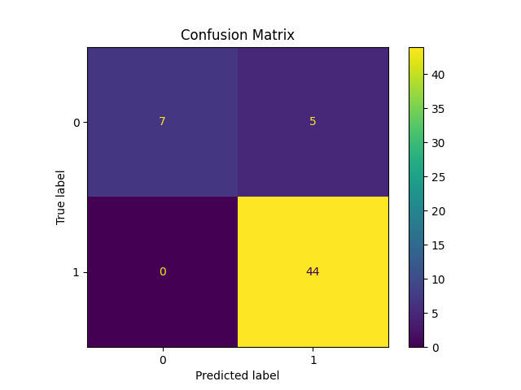
</p>

<p align="center">
  <em>Confusion matrix of the Decision Tree Classifier on the test set. Misclassifications are concentrated in the minority class, consistent with the underlying class imbalance.</em>
</p>

<p align="center">
  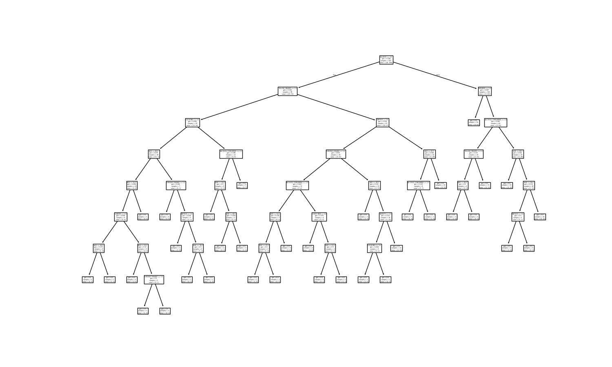
</p>

<p align="center">
  <em>Full structure of the trained (unpruned) decision tree, illustrating the feature splits used to classify lung cancer status.</em>
</p>

### Exploratory Findings

**Target and demographic distribution.** The dataset skews heavily toward positive lung cancer cases, and the age distribution of respondents is concentrated between roughly 45 and 70 years, consistent with the epidemiologically expected age range for lung cancer risk.

<p align="center">
  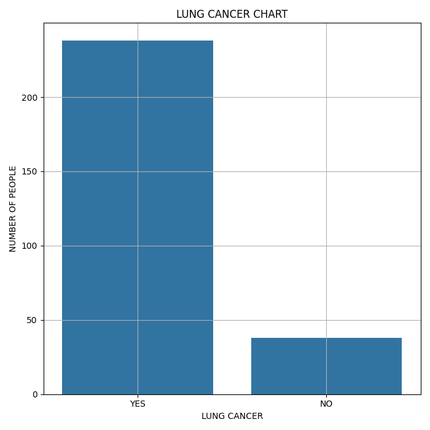
  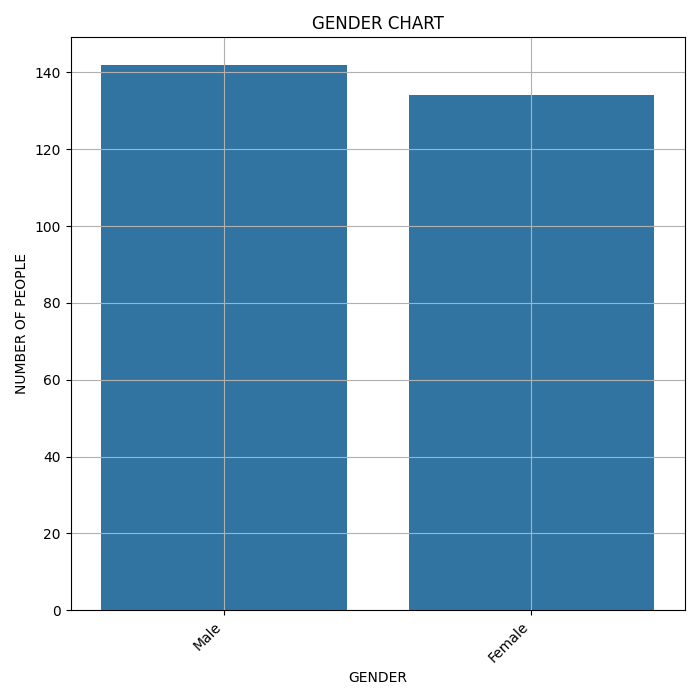
</p>

<p align="center">
  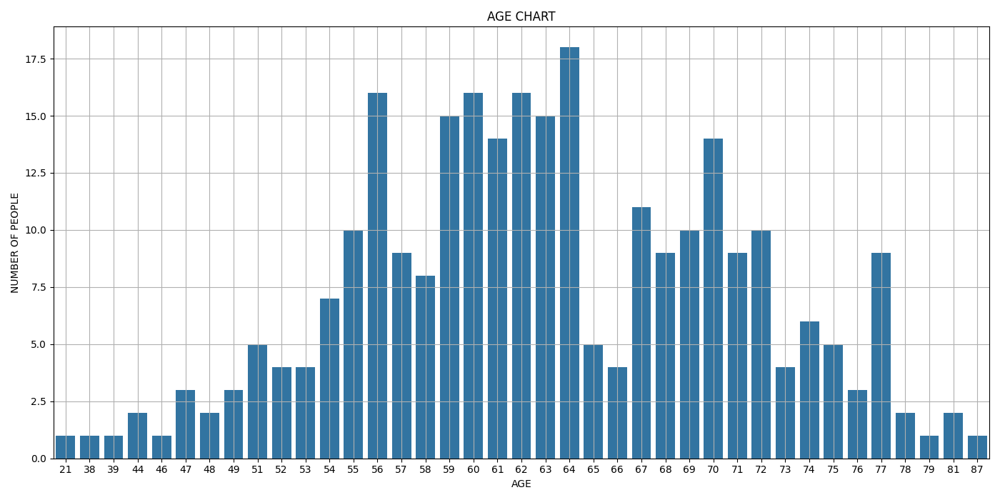
</p>

**Behavioral and symptomatic indicators.** The surveyed population shows a high prevalence of smoking, yellow fingers, anxiety, chronic disease, fatigue, and coughing — all established or hypothesized correlates of lung cancer risk in the clinical literature.

<p align="center">
  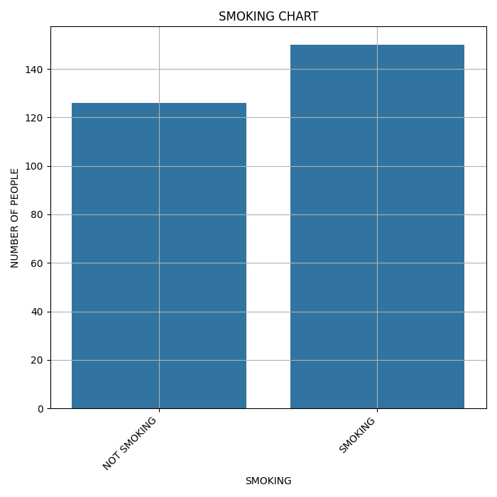
  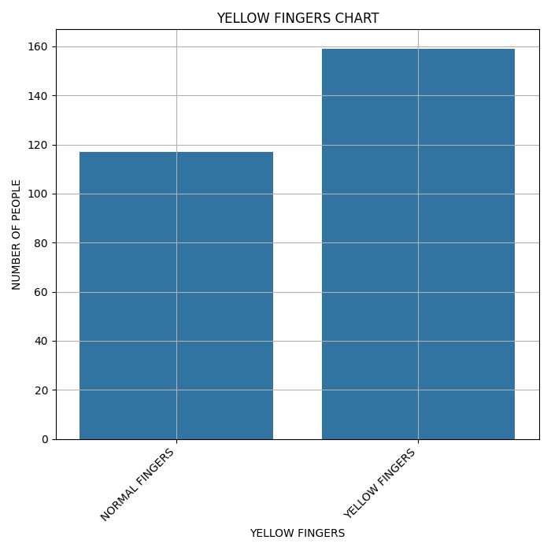
</p>

<p align="center">
  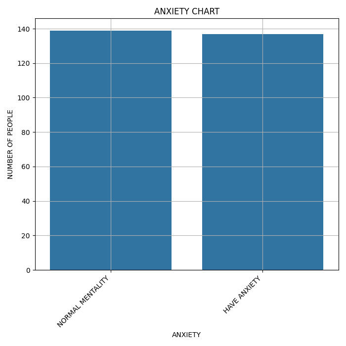
  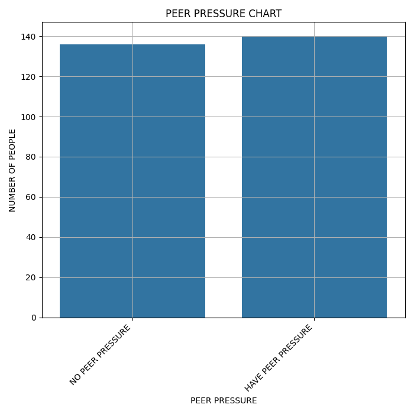
</p>

<p align="center">
  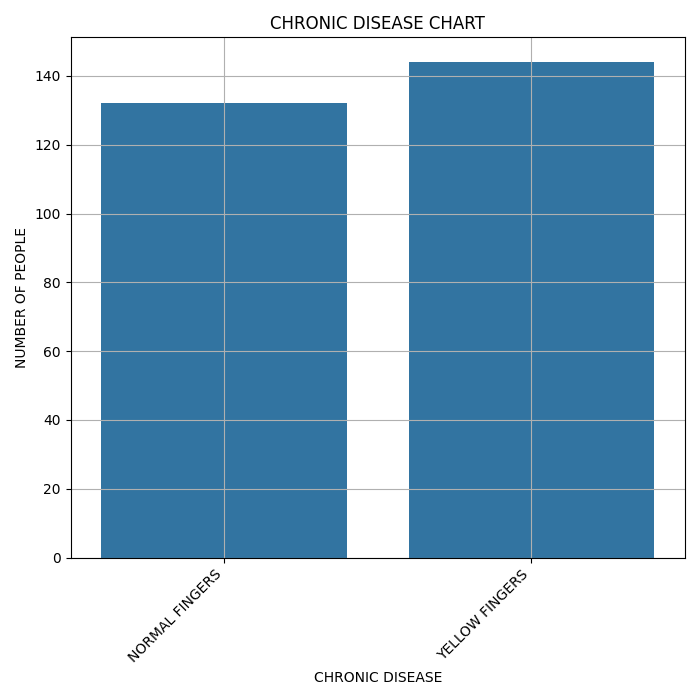
  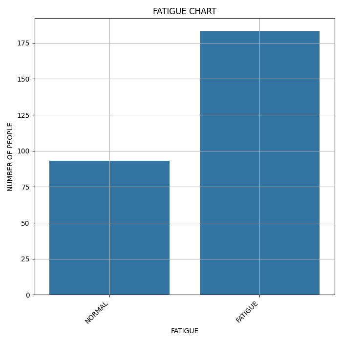
</p>

<p align="center">
  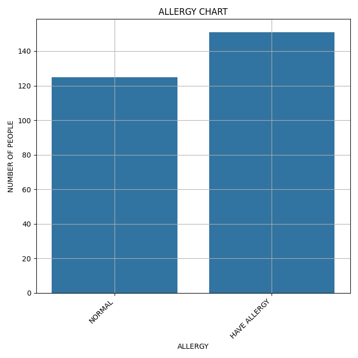
  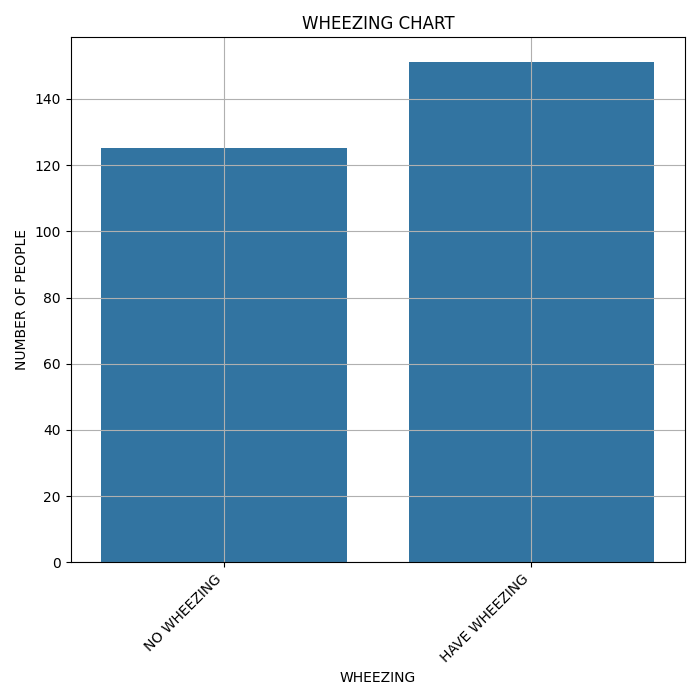
</p>

<p align="center">
  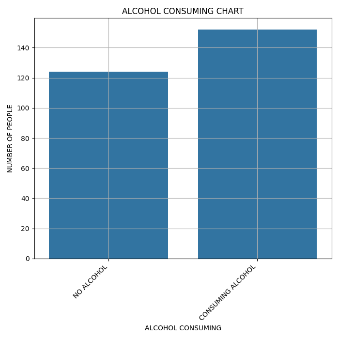
  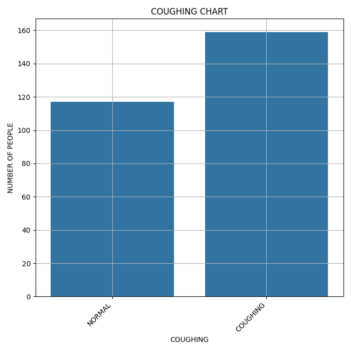
</p>

<p align="center">
  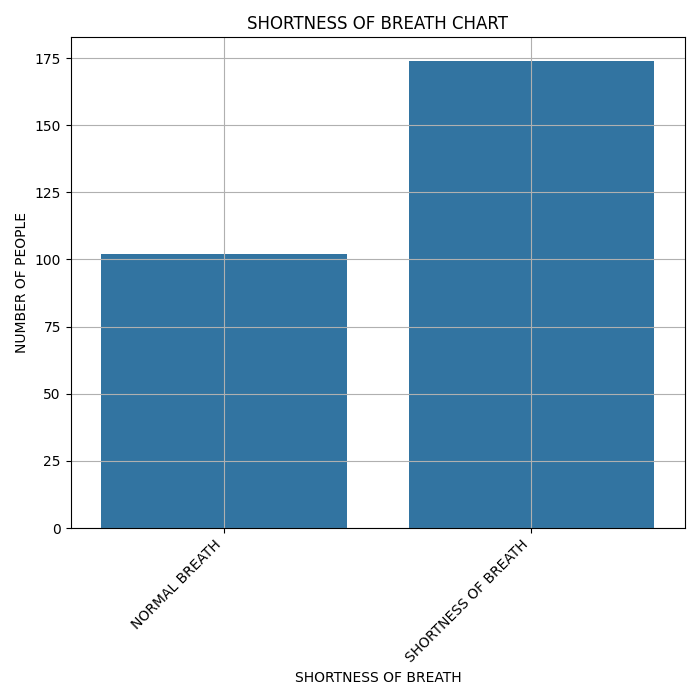
  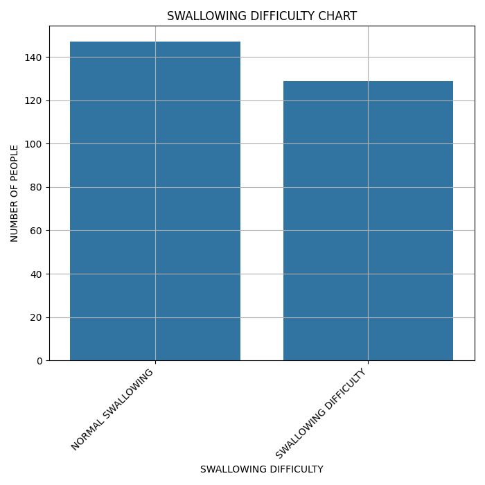
</p>

<p align="center">
  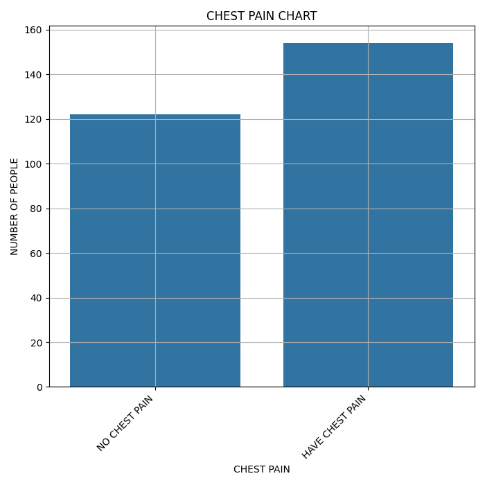
</p>

**Age-stratified trends.** Cross-tabulating lung cancer incidence and key risk factors against age reveals that positive cases, smoking prevalence, anxiety, and alcohol consumption are not uniformly distributed across the age spectrum but instead cluster within specific age bands, suggesting an interaction between age and behavioral/psychological risk factors rather than purely independent effects.

<p align="center">
  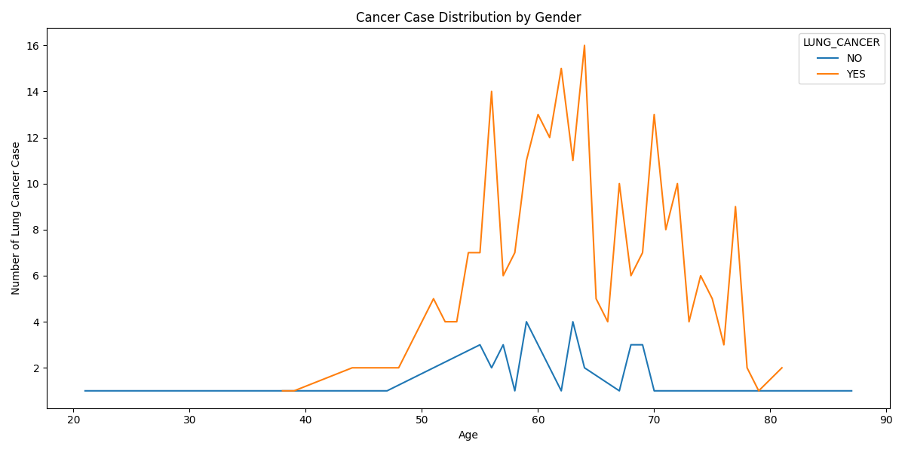
</p>

<p align="center">
  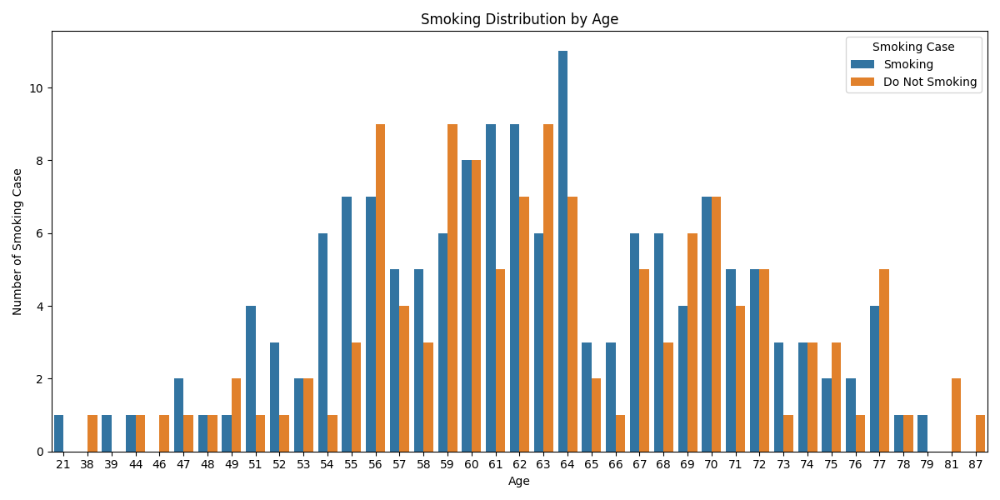
</p>

<p align="center">
  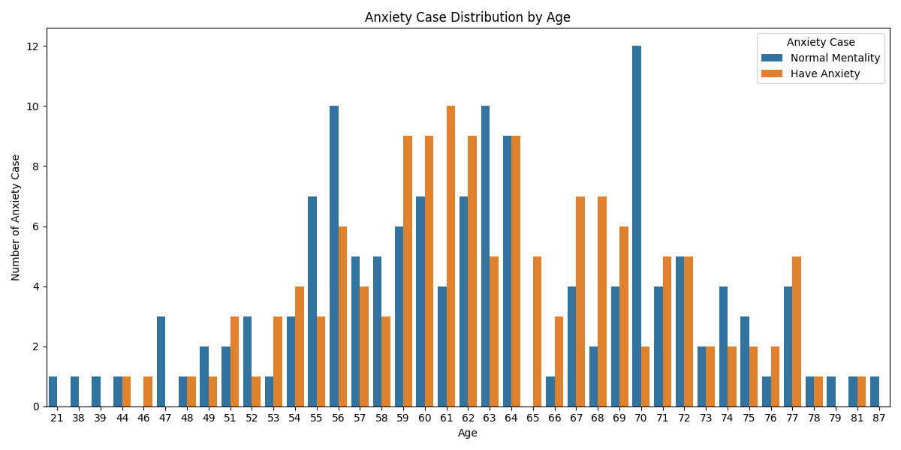
</p>

<p align="center">
  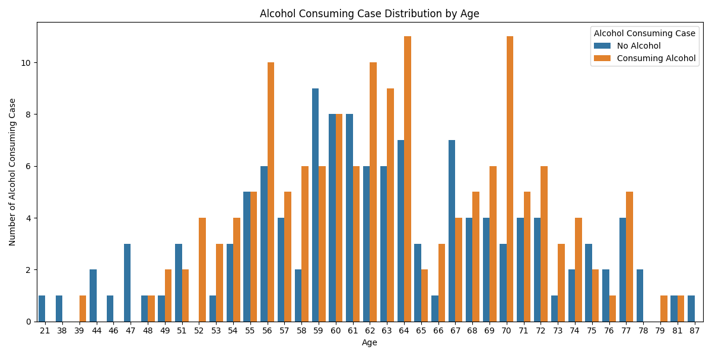
</p>

## Limitations

- **Class imbalance**: The target variable is heavily skewed toward positive cases (≈87%). No resampling technique (e.g., SMOTE, class weighting, undersampling) was applied prior to training, which likely inflates accuracy while suppressing minority-class recall. Future iterations should incorporate class-balancing strategies and report per-class precision/recall in addition to macro-averaged metrics.
- **Model complexity**: The decision tree was trained without depth constraints, pruning, or hyperparameter tuning (e.g., via cross-validation or grid search), which increases the risk of overfitting to the training set. Ensemble methods (Random Forest, Gradient Boosting) or regularized tree depth would likely improve generalization.
- **Self-reported survey data**: All features are derived from a self-administered survey rather than clinical measurement, introducing potential reporting bias and limiting the causal interpretability of the observed associations.
- **Sample size**: With 276 records after deduplication, the dataset is relatively small, which constrains the statistical power of both the EDA and the model evaluation, and increases the variance of the reported test-set metrics.

## Requirements

```
pandas
matplotlib
seaborn
scikit-learn
```

## Usage

```bash
# Run exploratory data analysis (generates charts in images/)
python lung_cancer_data_analysis.py

# Train and evaluate the decision tree model
python ml_lung_cancer_detection.py
```

## Data Source

Dataset: [Lung Cancer — Kaggle](https://www.kaggle.com/datasets/mysarahmadbhat/lung-cancer)
